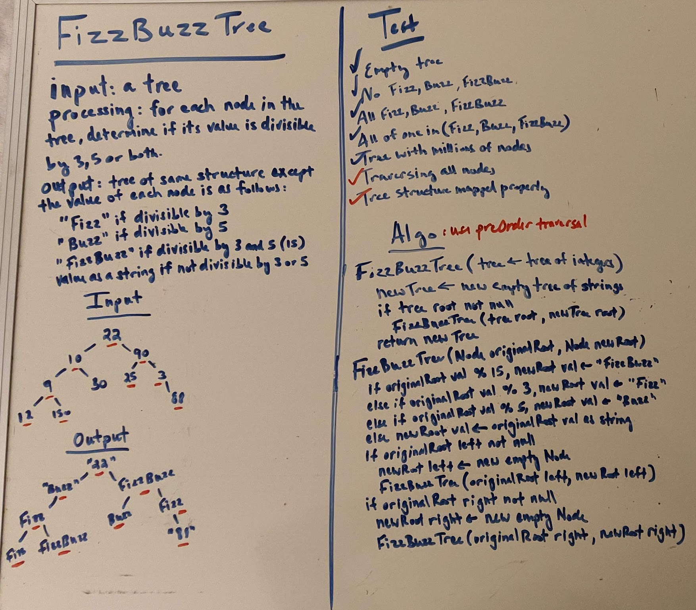

# Fizz Buzz Tree
Fizz Buzz problem using a binary tree. Given a tree of integers, map each value using the following logic to a tree of strings with the same structure.
  * If the value is divisible by 3, map "Fizz"
  * If divisible by 5, map "Buzz"
  * If divisible by both, map "FizzBuzz"
  * If not divisible by either, map the value as a string

## Tests
* Empty tree
* No value divisible by 5 or 3
* Every value divisible by 3, 5, or both
* All divisible by 3 or 5 or both
* Tree with millions of nodes
* Traverse all nodes
* Tree structure mapped correctly

## Approach
1. Create tests for the testing strategy above
2. Create a method called FizzBuzzTree that takes in a tree of integers.
   * Create a new tree of strings to store results
   * If original tree root not null, call the following function with the original tree root and the new tree root as arguments.
3. Create a helper method called FizzBuzzTree that takes in two nodes. The first node is from the original tree, and the second node is from the new tree.
   * If the original node value is divisible by 15, assign "FizzBuzz" to the new node value.
   * If the original node value is divisible by 3, assign "Fizz" to the new node value.
   * If the original node value is divisible by 5, assign "Buzz" to the new node value.
   * Else, assign the original node value as a string to the new node value.
   * If the original node's left node is not null:
     * Assign a new empty node to the new node's left node.
     * call FizzBuzzTree with the original node's left node and the new node's left node as arguments.
   * If the original node's right node is not null:
     * Assign a new empty node to the new node's right node.
     * call FizzBuzzTree with the original node's right node and the new node's right node as arguments.
4. Test

## Efficiency
* O(n) space complexity
* O(n) time complexity

## Link to Code
* [FizzBuzzTree.java](../src/main/java/code401Challenges/utilities/FizzBuzzTree.java)

## Whiteboard
* 