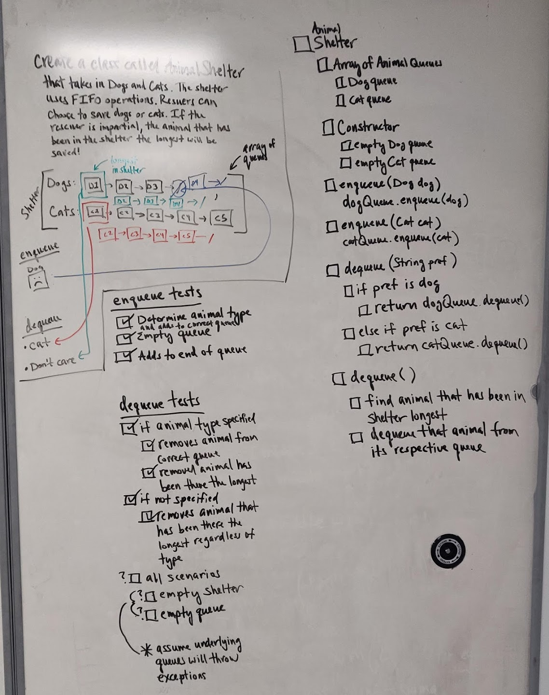

# Animal Shelter
Java implementation of an animal shelter for dogs and cats. The shelter uses first in first out operations. An animal rescuer may ask for a cat or a dog and will receive the specified animal type that has been in the shelter the longest. If the rescuer does not specify, they will receive the animal that has been in the shelter the longest.

## Approach & Efficiency
1. Develop tests for each of the following
2. Create a class called ShelterAnimal to represent an animal in the shelter.
3. Create a class called ShelterDog that extends ShelterAnimal to represent a dog.
4. Create a class called ShelterCat that extends ShelterAnimal to represent a dog.
2. Create a class called AnimalShelter which holds only dogs and cats. The shelter operates using a first-in, first-out approach.
3. Implement the following methods:
   - enqueue(animal): adds animal to the shelter. Animal can be either a dog or a cat object. This method has constant space and time complexity.
   - dequeue(pref): returns either a dog or a cat. If pref is not "dog" or "cat" then return the animal that has been in the shelter the longest. This method has constant space complexity and O(n) time complexity.
7. Test

## Link to Code
* [AnimalShelter.java](../src/main/java/code401Challenges/utilities/AnimalShelter.java)
* [ShelterAnimal.java](../src/main/java/code401Challenges/utilities/ShelterAnimal.java)
* [ShelterDog.java](../src/main/java/code401Challenges/utilities/ShelterDog.java)
* [ShelterCat.java](../src/main/java/code401Challenges/utilities/ShelterCat.java)

## Whiteboards

