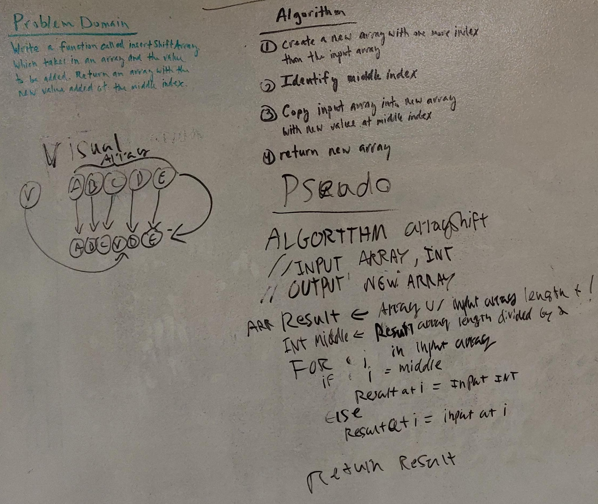

# Array Shift
Code Fellows 401 Java Code Challenge 2

## Challenge
Write a function called insertShiftArray which takes in an array and the value to be added. Without utilizing any of the built-in methods available to your language, return an array with the new value added at the middle index.

## Approach & Efficiency
1. Create a new array with a length one more than the input array.
2. Identify the middle index.
3. Copy input array into new array with new value at middle index.
4. Return new array.

## Link to Code
[ArrayShift.java](../src/main/java/code401Challenges/ArrayShift.java)

## Solution
