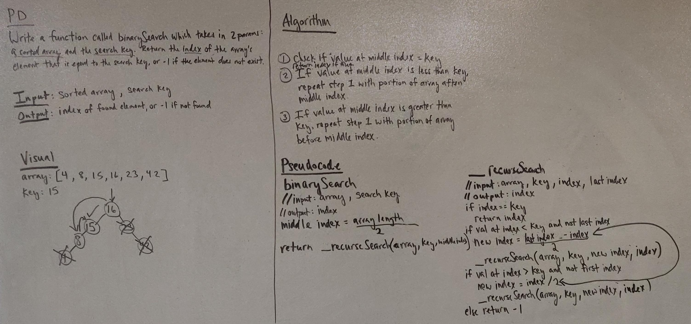

# Array Binary Search
Code Fellows 401 Java Code Challenge 3

## Challenge
Write a function called BinarySearch which takes in 2 parameters: a sorted array and the search key. Without utilizing any of the built-in methods available to your language, return the index of the array’s element that is equal to the search key, or -1 if the element does not exist.
## Approach & Efficiency
1. Check if value at middle index equals the key. Return middle index if true.
2. If value at middle index is less than the key, repeat step 1 with portion of array to the right of the current middle index.
3. If value at middle index is greater than the key, repeat step 1 with the portion of array to the left of the current middle index.
4. If value is not found, return -1.

## Link to Code
[ArrayReverse.java](../src/main/java/code401Challenges/BinarySearch/BinarySearch.java)

## Solution
