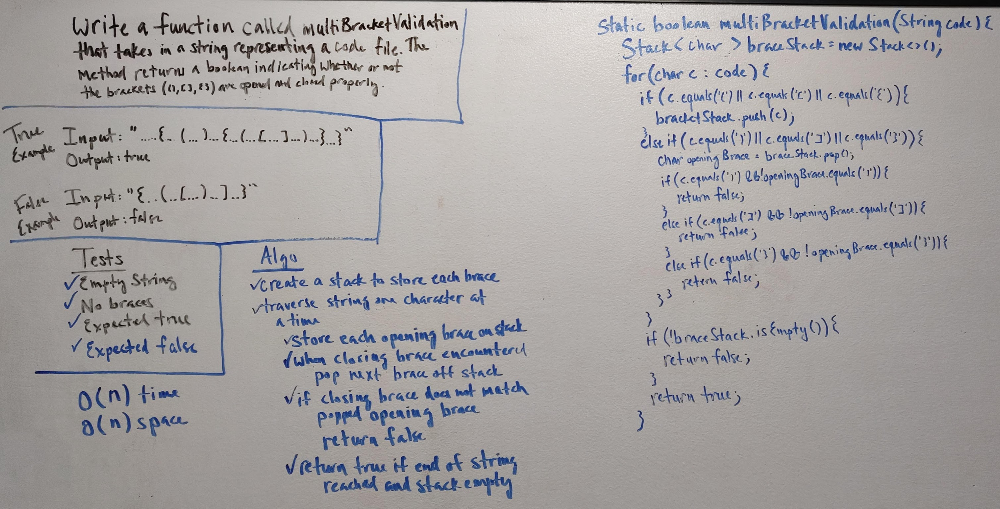

# Multi Bracket Validation
Function used to validate that brackets ('(', '[', '{') in a code file are properly closed. The function takes in a string input and return a boolean indicating whether or not the braces are closed properly.

## Approach & Efficiency
1. Develop tests for an empty string input, a string without braces, an expected true case, and an expected false case.
2. Create a stack to store each brace.
3. Traverse the string one character at a time.
4. Store each opening brace on the stack.
5. When a closing brace is encountered, pop the top brace off the stack.
6. If the closing brace does not match the popped opening brace, return false.
7. If the stack is not empty after traversal, return false.
8. If the stack is empty after traversal, return true.
7. Test

## Link to Code
* [MultiBracketValidation.java](../src/main/java/code401Challenges/utilities/MultiBracketValidation.java)

## Whiteboards

