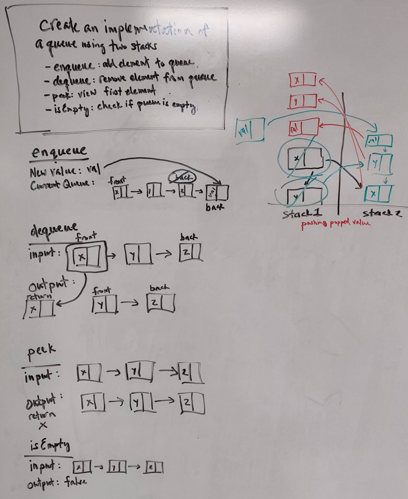
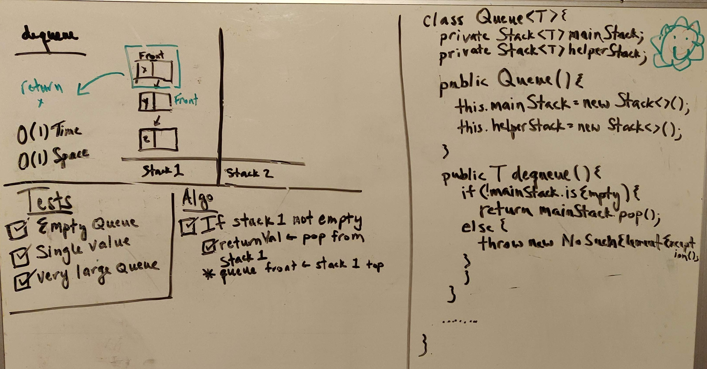
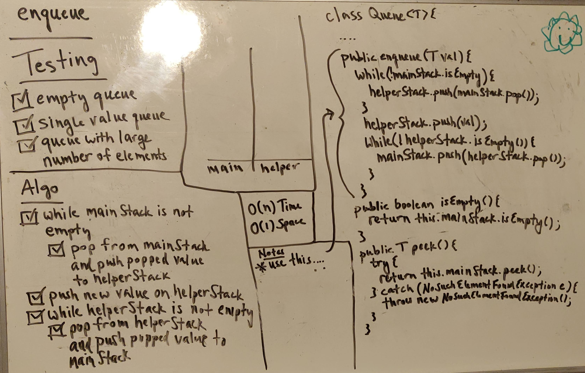

# Queue
Java implementation of a queue data structure using stacks rather than traditional list with front and rear nodes.

## Challenge
Implement a queue data structure with a constructor and the following methods: enqueue, dequeue, peek and isEmpty. Use stacks to implement this functionality.

## Approach & Efficiency
1. Develop tests for each of the following
2. This object should be aware of a default empty value assigned to front when the queue is created.
3. Define a method called enqueue which takes any value as an argument and adds a new node with that value to the back of the queue with an O(1) Time performance.
4. Define a method called dequeue that does not take any argument, removes the node from the front of the queue, and returns the node’s value.
5. Define a method called peek that does not take an argument and returns the value of the node located in the front of the queue, without removing it from the queue.
6. Define a method called isEmpty that does not take an argument, and returns a boolean indicating whether or not the queue is empty.
7. Test

## Link to Code
[PseudoQueue.java](../src/main/java/code401Challenges/pseudoqueue/PseudoQueue.java)

## Whiteboards

