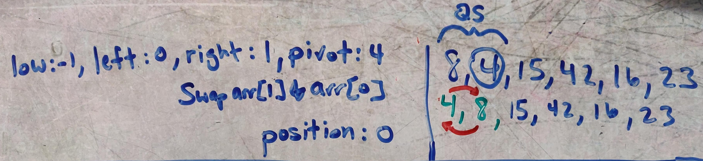

# Quick Sort
Quick Sort is a sorting algorithm that recursively divides an array into partitions based on the result of sorting the current partition according to a pivot point. The array is partitioned and sorted until the entire array is in sorted order.

## Pseudocode
    ALGORITHM QuickSort(arr, left, right)
        if left < right
            // Partition the array by setting the position of the pivot value 
            DEFINE position <-- Partition(arr, left, right)
            // Sort the left
            QuickSort(arr, left, position - 1)
            // Sort the right
            QuickSort(arr, position + 1, right)
    
    ALGORITHM Partition(arr, left, right)
        // set a pivot value as a point of reference
        DEFINE pivot <-- arr[right]
        // create a variable to track the largest index of numbers lower than the defined pivot
        DEFINE low <-- left - 1
        for i <- left to right do
            if arr[i] <= pivot
                low++
                Swap(arr, i, low)
    
         // place the value of the pivot location in the middle.
         // all numbers smaller than the pivot are on the left, larger on the right. 
         Swap(arr, right, low + 1)
        // return the pivot index point
         return low + 1
    
    ALGORITHM Swap(arr, i, low)
        DEFINE temp;
        temp <-- arr[i]
        arr[i] <-- arr[low]
        arr[low] <-- temp
      
## Trace
Sample array: [8, 4, 23, 42, 16, 15]

* We start by defining he position as the result of a call to partition on the entire array with 15 defined as the pivot value.
  * 
  * 8 and 4 are the only values less than 15, so they are "usefully" swapped with themselves.
  * 15 is swapped with 23, defining the partition index of 2.
    * We then call quicksort on the portion of the array to the left of the partition (15) with 4 defined as the pivot value.
      * 
      * 8 is not smaller than 4, so no swaps occur
      * 4 is swapped with 8, defining the partition index of 0.
    * We then call quicksort with 0 as the left value and -1 as the right value.
      * 0 is not less than left (0), so nothing is done.
    * We then call quicksort with 1 as the left and right values.
      * 1 is not less than 1, so nothing is done.
  * We are finished with the left side of 15!
* We then call quicksort on the portion of the array to the right of the partition (15) with 23 defined as the pivot value.
  * 
  * 42 is not less than 23, so no swap occurs
  * 16 is less than 23, so it is swapped with the low index of 3.
  * 23 is swapped with 42, defining the partition index of 4.
  * We then call quicksort with 3 as the left and right values.
    * 3 is not less than 3, so nothing is done.
  * We then call quicksort with 5 as the left and right values.
    * 5 is not less than 5, so nothing is done.
  * We are finished with the right side of 15!
* The array is sorted. That was quick ;-) 

Sorted Array: [4, 8, 15, 16, 23, 42]

## Efficiency
* O(n^2) time complexity. The algorithm could experience O(n^2) performance if array is in sorted order or if all the values are equal.
* O(1) space complexity. The algorithm sorts the array in place.

## Java Implementation
[Quick Sort](../src/main/java/code401Challenges/sort/Sort.java)

## Tests
[Quick Sort Tests](../src/test/java/code401Challenges/sort/SortTest.java)

  