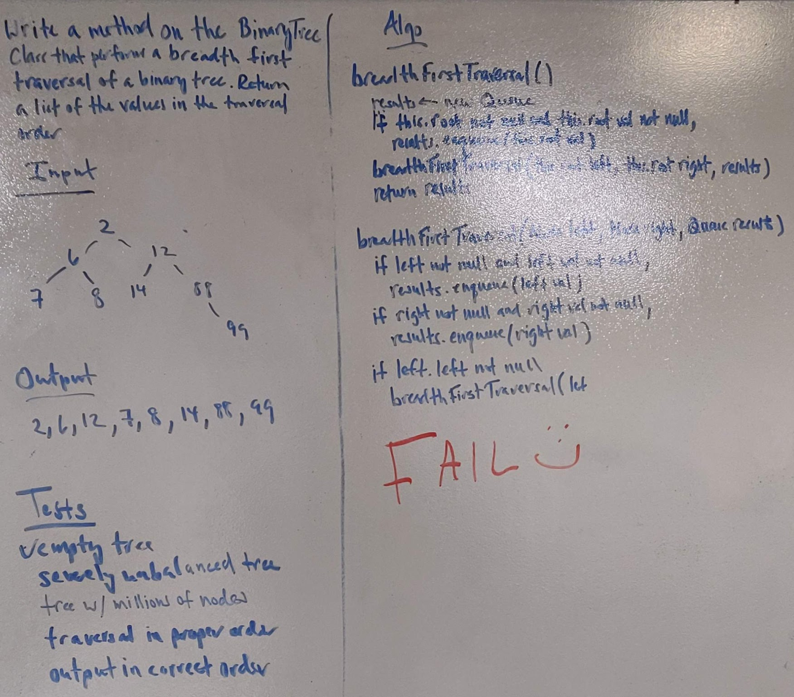

# Trees
Java package for binary trees and their methods

## Approach
1. Create a Node class that has properties for the value stored in the node, the left child node, and the right child node.
2. Create a BinaryTree class
   * Define a method for each of the depth first traversals called preOrder, inOrder, and postOrder which returns an queue of the values, ordered appropriately.
   * Define a breadth first traversal method which returns an queue of the values, ordered appropriately.
3. Any exceptions or errors that come from your code should be semantic, capturable errors. For example, rather than a default error thrown by your language, your code should raise/throw a custom, semantic error that describes what went wrong in calling the methods you wrote for this lab.
4. Create a BinarySearchTree class
   * Define a method named add that accepts a value, and adds a new node with that value in the correct location in the binary search tree.
   * Define a method named contains that accepts a value, and returns a boolean indicating whether or not the value is in the tree at least once.
5. Test

## Link to Code
* [Node.java](../src/main/java/code401Challenges/tree/Node.java)
* [BinaryTree.java](../src/main/java/code401Challenges/tree/BinaryTree.java)
* [BinarySearchTree.java](../src/main/java/code401Challenges/tree/BinarySearchTree.java)

## Whiteboards
* 
* 